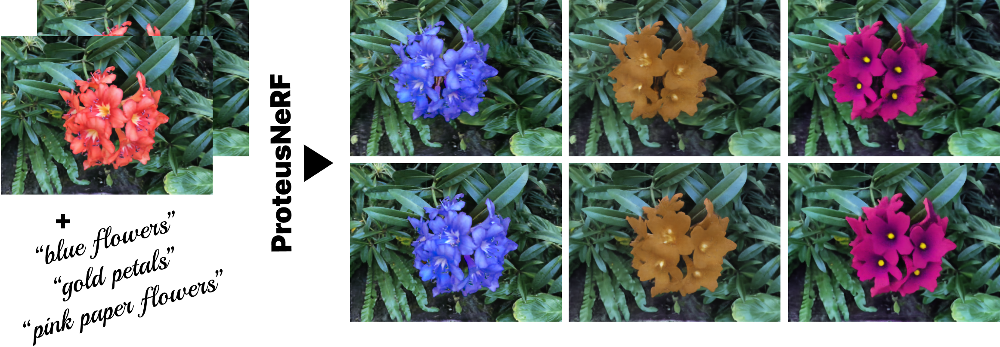

# ProteusNeRF

## [Project page](https://proteusnerf.github.io/) |  [Paper](https://arxiv.org/abs/2310.09965)
This repository contains a pytorch implementation for the paper: [ProteusNeRF: Fast Lightweight NeRF Editing using 3D-Aware Image Contexts](https://arxiv.org/abs/2310.09965). Our work present a **fast** and **lightweight** framework for interactive editing of NeRF assets via **existing image manipulation tools** or generative frameworks.




#### Tested on Ubuntu 20.04

Install environment:
```
conda create -n ProteusNeRF python=3.10
conda activate ProteusNeRF
conda install pytorch torchvision torchaudio pytorch-cuda=11.8 -c pytorch -c nvidia
pip install opencv-python matplotlib numpy tqdm kornia scikit-learn diffusers["torch"] transformers jupyter
```

## Quick Start
### 1. Smaller appearance-only edits
open and run ```edit_LLFF_app.ipynb```
### 2. Larger edits
open and run ```edit_LLFF_geo.ipynb```

## Train and edit model from scratch
### 1. Prepare Dataset
* [LLFF dataset](https://drive.google.com/drive/folders/128yBriW1IG_3NJ5Rp7APSTZsJqdJdfc1) 
download ```nerf_llff_data.zip```
unzip to ```./Dataset``` folder

### 2. Train NeRF
* Download [DINO pretrained model](https://dl.fbaipublicfiles.com/dino/dino_vitbase8_pretrain/dino_vitbase8_pretrain.pth) to ```./pre_trained_models```
* Prepare features data of dataset by command:
```python get_fea.py --scene [SCENE]```
* Train NeRF
```python train_LLFF.py --scene [SCENE]```;

### 3. Set trained weights as NeRF asset
Copy trained ```bestmodel.pth``` file in folder ```./training_results``` to folder ```./pre_trained_models```
rename trained file as ```[SCENE].pth```

Note: ```[SCENE]``` is one of the folder name in the folder ```./nerf_llff_data``` e.g. ```flower```, ```horns``` etc. 

### Now you can try the above quick start

## To do
- [x] Release Methods
- [x] Optimise Render processing

Editing speed: ```10-70s (A100)``` -> ```3-58s (4090)```

Rendering speed: ```0.6-1.5 fps (A100)``` -> ```2-2.2 fps (4090)```